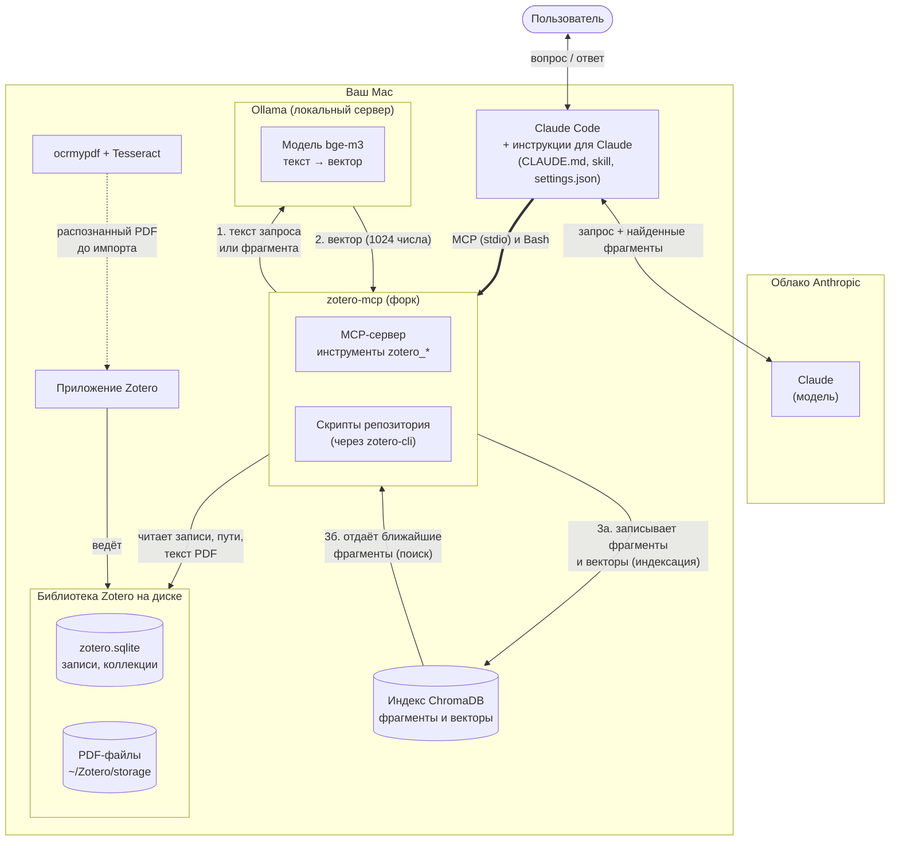
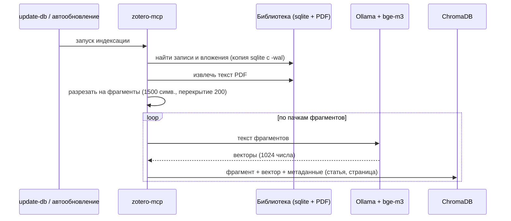
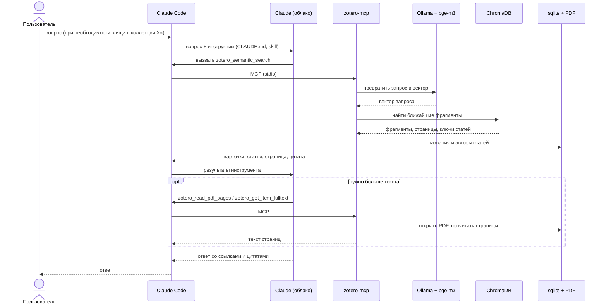

# Архитектура

Решение позволяет задать вопрос нейросети по вашей библиотеке Zotero и получить статьи с цитатами и страницами. Поиск идёт **по смыслу** (а не по словам) в **полных текстах** PDF; вопрос можно задавать на одном языке, а статьи могут быть на другом.

Единая точка входа в Zotero — MCP-сервер `zotero-mcp`. К нему может подключаться любой клиент с поддержкой MCP, поэтому всё, что связано с Zotero, настраивается один раз, а нейросети подключаются отдельно ([docs/clients/](clients/claude-code.md)).

## Компонентная диаграмма

Обозначения: сплошная стрелка — вызов или чтение, жирная — канал клиента к zotero-mcp, пунктир — шаг, который выполняется отдельно и заранее (OCR до импорта в Zotero). Стрелки от блока «zotero-mcp» относятся ко всем его частям (сервер и скрипты), различия описаны ниже.

Кто с чем работает:
- **Ollama с моделью bge-m3 только считает.** Она получает текст и возвращает вектор. В индекс она ничего не пишет и к нему не обращается.
- **В ChromaDB пишет и читает только zotero-mcp.** При индексации он сам кладёт туда фрагменты и полученные от Ollama векторы, при поиске сам запрашивает ближайшие.
- **Приложение Zotero не участвует в поиске.** Сервер читает файлы библиотеки (`zotero.sqlite` и PDF) напрямую, поэтому Zotero может быть закрыто.

## Компоненты

| Компонент | Что это | Где работает | Роль |
|---|---|---|---|
| **Claude Code** | Клиент ИИ (приложение Claude, вкладка Code) | Ваш Mac | Принимает вопрос, читает инструкции, вызывает инструменты MCP и скрипты, отправляет контекст в модель |
| **Claude** | Модель Anthropic | Облако | Формулирует запросы к библиотеке и пишет ответ по полученным фрагментам |
| **Инструкции для Claude** | `CLAUDE.md`, skill `zotero-library`, `settings.json` | Репозиторий (`ai-instructions/claude/`) | Описывают, как искать, как оформлять цитаты, что можно делать без подтверждения |
| **zotero-mcp** | MCP-сервер ([форк](setup/04-mcp-server.md) оригинала 54yyyu/zotero-mcp) | Ваш Mac, процесс запускает Claude Code | Единая точка входа: инструменты поиска и чтения (`zotero_*`), построение индекса |
| **zotero-cli** | Консольный клиент из того же пакета | Ваш Mac | Те же возможности из командной строки; нужен скриптам для поиска внутри коллекции |
| **Скрипты репозитория** | `scripts/` | Ваш Mac | Поиск в коллекции и поиск нескольких мест одной записи (`search-in-collection.sh`, `search-passages.sh`), проверка библиотеки (текстовый слой PDF, не попавшие в индекс статьи) |
| **Ollama** | Локальный сервер моделей | Ваш Mac, `localhost:11434` | Возвращает вектор для переданного текста. Сам ничего не хранит и в индекс не пишет |
| **Модель bge-m3** | Многоязычная модель эмбеддингов | Внутри Ollama | Превращает текст в вектор из 1024 чисел так, что тексты с близким смыслом (на любых языках из её набора) получают близкие векторы |
| **Индекс ChromaDB** | Векторная база | `~/.config/zotero-mcp/chroma_db` | Хранит фрагменты текста статей, их векторы и метаданные (статья, страница, номер фрагмента). Заполняет и читает zotero-mcp; Ollama к индексу не обращается |
| **config.json** | Настройки zotero-mcp | `~/.config/zotero-mcp/config.json` | Модель эмбеддингов, размер фрагментов, ширина цитаты, лимиты страниц, автообновление |
| **Приложение Zotero** | Ваш менеджер библиографии | Ваш Mac | Ведёт библиотеку и хранит файлы. Для поиска и чтения не нужно: сервер читает файлы напрямую |
| **zotero.sqlite** | База Zotero | `~/Zotero/zotero.sqlite` | Записи, коллекции, теги, пути к вложениям |
| **PDF-файлы** | Вложения | `~/Zotero/storage/` | Источник текста для индекса и для чтения страниц |
| **ocrmypdf + Tesseract** | OCR | Ваш Mac, отдельным шагом | Добавляет текстовый слой в сканы **до** импорта в Zotero ([шаг 6](setup/06-ocr.md)) |

## Как это работает

### 1. Подготовка: индексация

Индексация нужна один раз и затем при добавлении новых статей ([шаг 5](setup/05-indexing.md)). Её запускает `zotero-mcp update-db --fulltext` (вручную или автоматически).

1. Сервер читает **копию** `zotero.sqlite` вместе с журналом `-wal` (поэтому Zotero не обязан быть закрыт или запущен) и находит записи библиотеки и их PDF-вложения.
2. Из каждого PDF сервер извлекает текст. Если PDF не читается как текст (например, скан со встроенным OCR-слоем, который извлекатель считает картинкой), берётся кеш полного текста Zotero (в индексе такой источник помечен `zotero-cache`). Если текста нет и там, статья попадает в индекс только по метаданным.
3. Текст режется на фрагменты по 1500 символов с перекрытием 200 (до 800 фрагментов на статью, до 1000 страниц на PDF).
4. Для каждого фрагмента сервер просит у **Ollama** вектор. Ollama прогоняет текст через **bge-m3**, получается вектор из 1024 чисел.
5. Фрагмент, вектор и метаданные (ключ статьи, страница, номер фрагмента, название, авторы) записываются в **ChromaDB**.

Обновление **инкрементальное**: повторные запуски индексируют только новые и изменённые записи и убирают удалённые.

### 2. Вопрос без ограничения по коллекции

1. Вы пишете вопрос в Claude Code. Claude Code отправляет его в модель вместе с инструкциями (`CLAUDE.md`, skill).
2. Перед первым обращением Claude проверяет Ollama и запускает `check-text-layer.sh`, который предупреждает о PDF без текстового слоя и о статьях, которых нет в индексе.
3. Модель вызывает инструмент `zotero_semantic_search`. Claude Code отправляет вызов серверу по MCP (stdio).
4. Сервер просит Ollama превратить **запрос** в вектор (та же модель bge-m3), и ищет в ChromaDB ближайшие по смыслу фрагменты. Фрагменты одной статьи группируются, остаётся лучший из них.
5. Для каждой статьи сервер собирает карточку: название, авторы, ключ, страница, номер фрагмента и **цитата** (длина задаётся `snippet_width`, у нас 1500 символов, то есть фрагмент целиком). Название и метаданные берутся из `zotero.sqlite`.
6. Результат уходит обратно через MCP в Claude Code, а оттуда в модель. Модель оформляет ответ со ссылками и дословными цитатами, при необходимости дочитывает страницы (`zotero_read_pdf_pages`, `zotero_get_item_fulltext`: сервер открывает PDF из `~/Zotero/storage`, путь берёт из `zotero.sqlite`).

### Диаграмма последовательности: вопрос

### 3. Вопрос внутри одной коллекции

Инструмент `zotero_semantic_search` не может ограничить поиск набором статей: для этого нужен вложенный фильтр, а Claude Code не передаёт такие параметры по MCP (подробности в [troubleshooting](troubleshooting.md)). Поэтому:

1. Claude вызывает `scripts/search-in-collection.sh "запрос" --collection "Название"`.
2. Скрипт находит коллекцию в копии `zotero.sqlite` и собирает ключи её статей.
3. Скрипт запускает `zotero-cli search --mode semantic` с фильтром «только эти ключи». Дальше всё как в пункте 4 предыдущего сценария: Ollama, ChromaDB, карточки.

Индекс при этом не перестраивается: набор статей определяется в момент запроса, поэтому перенос статьи между коллекциями вступает в силу сразу.

### 4. Несколько мест одной записи

Инструмент `zotero_semantic_search` и `zotero-cli` группируют результаты по записи и отдают одно лучшее место, хотя в индексе лежат все фрагменты. Скрипт `scripts/search-passages.sh` обращается к индексу напрямую (та же ChromaDB, тот же Ollama и `bge-m3`), снимает это ограничение и показывает все подходящие места с номерами страниц; для расшифровок лекций добавляет время и спикеров из текста.

### 5. Сканы

Сканы без текстового слоя поиск не видит. Поэтому PDF сначала прогоняют через `ocrmypdf` (языки `rus+eng`, режим `--skip-text`), и только потом добавляют в Zotero. Если этот шаг забыт, `check-text-layer.sh` предупредит в начале сессии.

## Что работает локально, а что уходит в облако

| Что | Где обрабатывается |
|---|---|
| Индекс, эмбеддинги, поиск ближайших фрагментов | **Локально.** Тексты статей для построения индекса никуда не отправляются |
| Ollama и bge-m3 | **Локально** |
| Zotero, SQLite, PDF | **Локально** |
| Ваш вопрос, найденные фрагменты, страницы и тексты, которые Claude читает по ходу ответа | **Уходят в облако Anthropic** как часть диалога с моделью. Вся библиотека не отправляется, только то, что вернули инструменты |

Чтобы уменьшить объём, уходящий в облако, ограничивайте поиск коллекцией и не разрешайте чтение полных текстов лишних статей. Для полностью локальной работы потребуется локальная модель; этот вариант пока не прорабатывался.

## Что общее для всех нейросетей, а что нет

| Общее (делается один раз на Mac) | Зависит от нейросети |
|---|---|
| Zotero, Ollama, bge-m3, zotero-mcp, индекс, OCR ([docs/setup/](setup/01-prerequisites.md)) | Как подключить MCP-сервер к клиенту ([docs/clients/](clients/claude-code.md)) |
| Скрипты поиска и проверки (`scripts/`) | Инструкции для нейросети: формат и расположение файлов ([ai-instructions/](../ai-instructions/README.md)) |

## Порты и расположение файлов

| Что | Значение |
|---|---|
| Ollama | `http://127.0.0.1:11434` |
| Настройки и индекс | `~/.config/zotero-mcp/` (`config.json`, `chroma_db/`) |
| Библиотека Zotero | `~/Zotero/` (`zotero.sqlite`, `storage/`) |
| Установка zotero-mcp | `~/.local/share/uv/tools/zotero-mcp-server/`, команды в `~/.local/bin/` |
